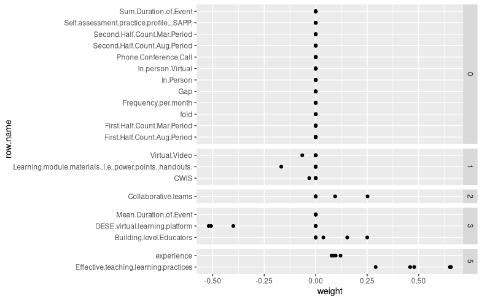

# Predictive Modeling

 Lasso (Least Absolute Shrinkage and Selection Operator) is a regression analysis method that performs both variable selection and regularization in order to enhance the prediction accuracy and interpretability of the resulting statistical model. 
 
 I applied the Lasso Regression using the cv.glmnet package in R. The output is the variable importance coefficient for each feature in the dataset. 

 ```R
 library(glmnet)
 cv.fit.gaussian <- cv.glmnet(X_train, y_train, family = "binomial")
 ```

 After applying the input data into the model, the cv.glmnet takes the data as input and assigns a coefficient (importance value) to each feature. For the cv.glmnet, a target variable is required. The target variable is the variable whose values are to be modeled and predicted by other variables. Here, `ETL.AVERAGE` is the target variable. Calculation of the feature importance is done based on the co-efficient values obtained from cv.glmnet.

 Feature importance plot is drawn using `ggplot2`.

```R
library(ggplot2)
ggplot()+
  facet_grid(n.nonzero ~ ., scales="free", space="free")+
  geom_point(aes(
    weight, row.name),
    data=weight.dt)
```
## Feature Importance Plot
The x-axis represents the features present in the dataset. The y-axis represents the co-efficient values obtained from cv.glmnet model. The figure is shown below:




To validate the model, comparison is done with 3 featureless baselines like L0, L1, and L2 baselines. The L0 regression is the most frequent response variable. L1 regression is the median of the response variable. L2 is the mean of the response variable.

The baseline models are not dependent on input. They simply use statistical analysis to calculate the output variable. A model performs well if it performs better than the baseline models. 

```R
  freq <-as.data.frame(table(y_train))
  median.values <- sort(y_train)
  median.ind.val <- median(median.values)
  mean.ind.val <- mean(y_train)

  predictions.list <-  list(
    glmnet.binomial=as.numeric(predict(cv.fit.gaussian,newx=X_test,s=cv.fitgaussian$lambda.1se,type="response")),
    baseline.l0=one.pred(as.numeric.factor(freq[which.max(freq$Freq),]$y_train)),
    baseline.l1=one.pred(median.ind.val),
    baseline.l2=one.pred(mean.ind.val)
  )

```
Calculating log loss error
```
    for(algo in names(predictions.list)){
    pred.vec = predictions.list[[algo]]
    accuracy.dt.list[[algo]] <- data.table(
      algo.name = algo,
      log.loss.error=MLmetrics::LogLoss(y_pred = pred.vec, y_true = actual)
    )
  }

  error.values = final.accuracy.list$accuracies.log.loss.error
  model=final.accuracy.list$accuracies.algo.name
  log.loss.error = error.values
```
Creating the ggplot
```
ggplot()+
  geom_point(aes(
    x = log.loss.error,y=model)) + ggtitle("Log Loss CV.glmnet VS Baselines") 
```

After comparison with the baselines it seems that the model outperformed the baselines performance.

## Comparison of cv.glmnet with Baseline models

The x-axis represents the models for comparison. The y-axis represents the log loss error.


